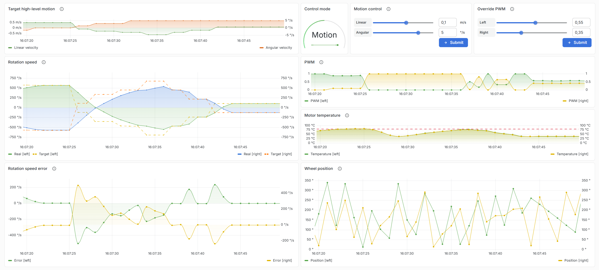

# Robbi HMI - University Project for "IoT & Manufacturing Execution System"

A containerized system for real-time monitoring and control of industrial automation equipment. Integrates Siemens PLC communication via OPC UA with a Python backend, time-series database, and interactive dashboards.

## Overview

The system simulates an autonomous robotic vehicle with independently controlled motors. It demonstrates the integration of industrial control systems with modern cloud-native technologies, using a Python backend as a communication layer between a PLC, InfluxDB time-series database, and Grafana visualization platform. The entire infrastructure is designed with the Infrastructure as Code (IaC) principle in mind, with all components defined declaratively in Docker and Docker Compose configuration files.

## Tech Stack

- **FastAPI** – Python web framework for the backend API
- **OPC UA** – Industrial protocol for PLC communication
- **InfluxDB** – Time-series database for sensor and actuator data
- **Grafana** – Dashboard and visualization platform
- **Docker & Docker Compose** – Containerized deployment

## Architecture

The PLC communicates via OPC UA to a Python backend running on FastAPI. The backend handles device communication asynchronously and writes data to InfluxDB. Grafana connects to InfluxDB for real-time visualization and provides an interactive dashboard.
